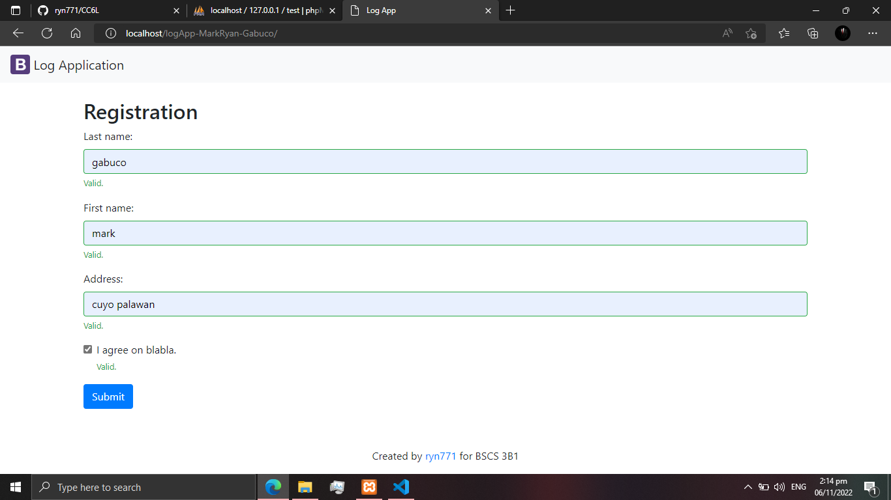
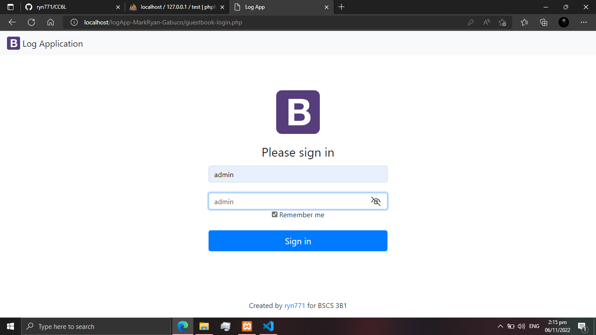
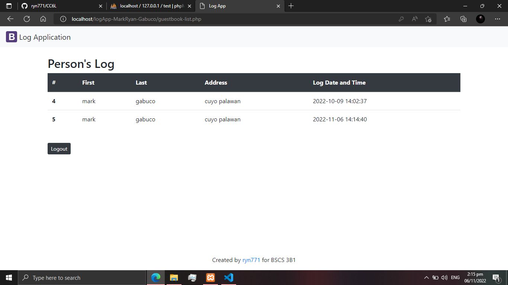
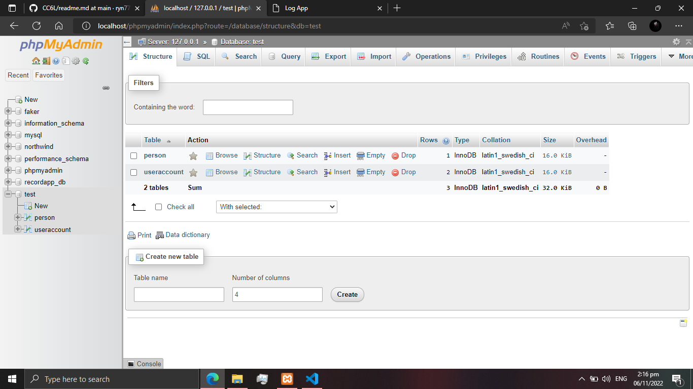

# :clipboard::heavy_check_mark:**05_Practice_Sets**

## :memo: **_Description_**

This repository is about practice sets 05. It is a website where the user can enter his name and address and the admin can login to see the list of people who log.

---

## :pushpin: **_Visuals_** :camera:

### :paperclip: **Registration**



### :paperclip: **Login**



### :paperclip: **List of people who log to the website**



## :wrench: **_Installation_** :wrench:

### :arrow_down: **Download**

1. _Download and install the application XAMPP or WAMP to have an access to the localhost phpmyadmin._

### :hammer: **Creating a Database**

2. _When you are done installing the application, you can now create your own database. You can name your database, add tables and columns._

   Example:

   - **Database name:** test
   - **Table 1:** person
   - **Table 2:** useraccount  
     

### :electric_plug: **Creating a connection to your database**

3. _Edit the file config.php in the folder config and define the values set for DB_HOST, DB_USER, DB_PASS, DB_NAME. Enter values depending on what host you are using, it's either local host or online host._

:scroll: **Sample code for connecting to local host**

```
<?php
    define('ROOT_URL', 'http://localhost/logApp-scaling-octo/index.php');
    define('DB_HOST', 'localhost');
    define('DB_USER', 'root');
    define('DB_PASS', '');
    define('DB_NAME', 'test');
?>
```

:scroll: **Sample code for connecting to online host**

```
<?php

    define('ROOT_URL', 'http://localhost/logApp-scaling-octo/index.php');
    define('DB_HOST', 'sql6.freesqldatabase.com');
    define('DB_USER', 'sql6524604');
    define('DB_PASS', 'Zg5kj65P8T');
    define('DB_NAME', 'sql6524604');
?>
```

---

## :round_pushpin: ***Authors*** :boy:

## **_MARK RYAN O GABUCO_** :beginner:

### **_BSIT 3B1_** :star2::star2::star2:


---
